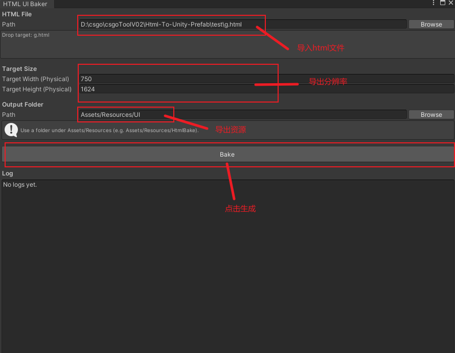
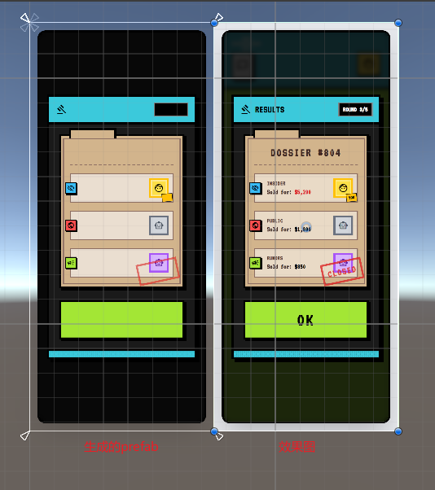
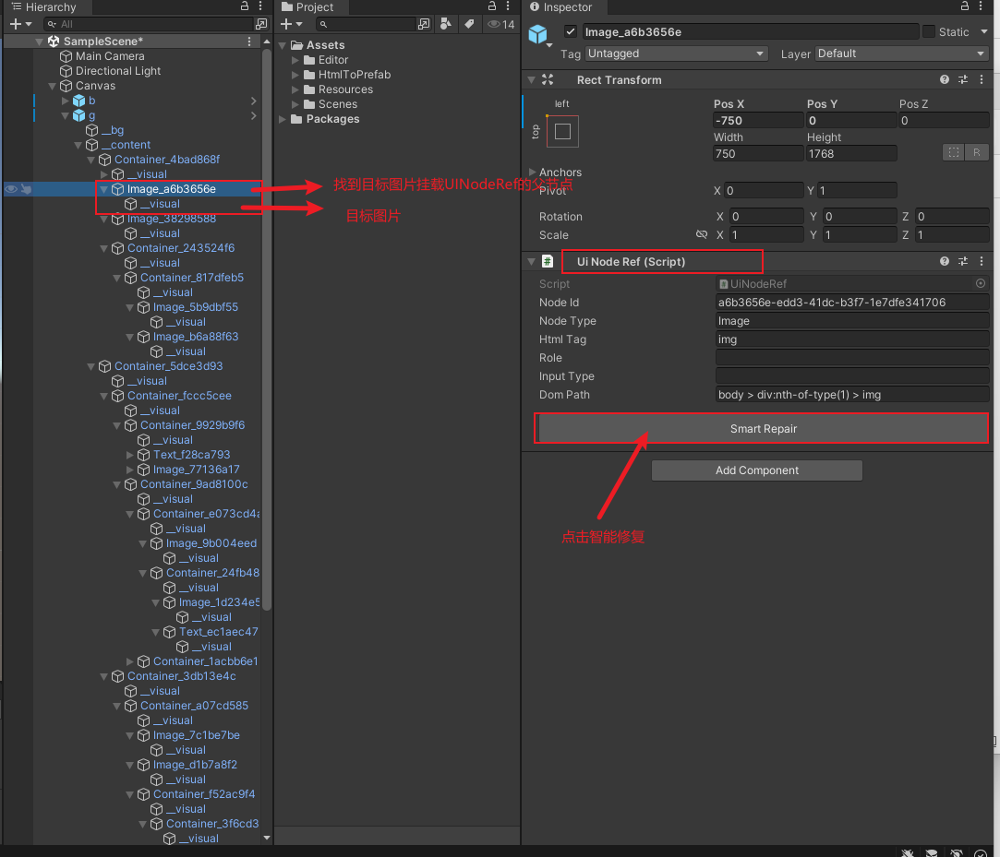
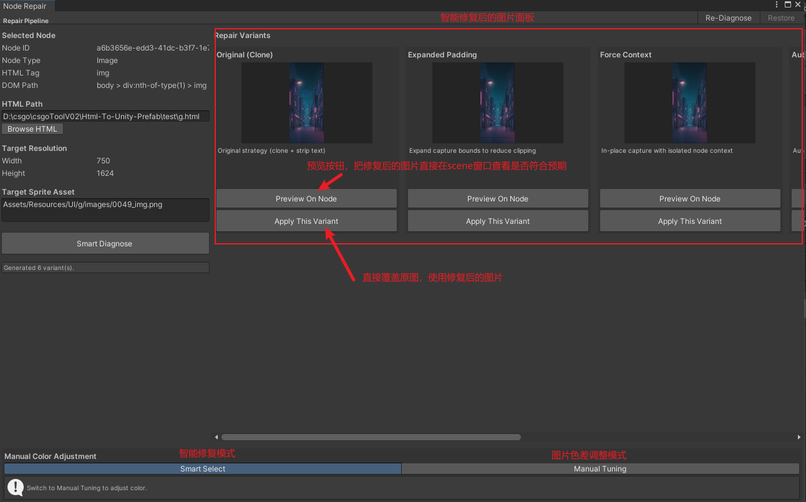
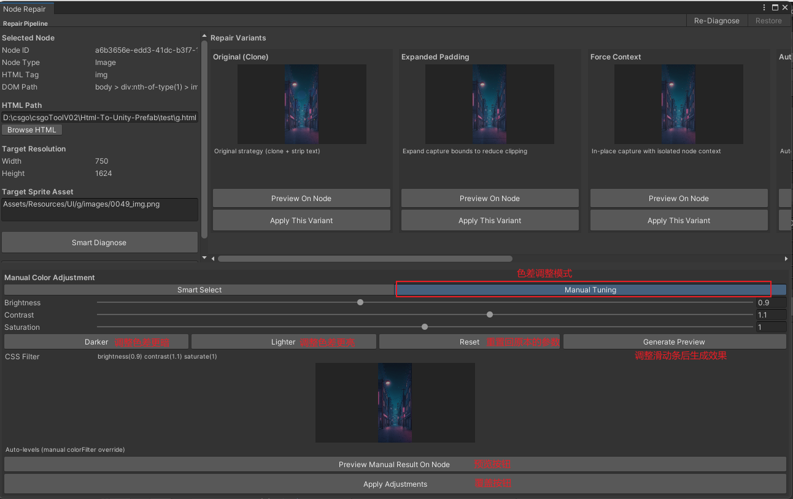

# HTML-To-Unity-Prefab

将 HTML UI 自动转换为 Unity 可用的 `layout.json + 图片资源 + Prefab`，并支持单节点图片增量修复（Repair Pipeline）。

## 目录
1. [从零开始部署工程](#从零开始部署工程)
2. [通用 HTML 转 Prefab：架构、原理、使用方式](#通用-html-转-prefab架构原理使用方式)
3. [单张图片修复（Repair Pipeline）：设计、痛点、使用方式](#单张图片修复repair-pipeline设计痛点使用方式)
4. [常见问题](#常见问题)

## 从 0 开始部署工程

### 1. 环境要求
- Unity：建议 2021.3 LTS 或更高（项目已使用 UGUI + TextMeshPro）。
- Node.js：建议 18+（Puppeteer 24 需要较新 Node 版本）。
- npm：建议 `9+`
- 系统：Windows/macOS/Linux（需可运行 Node + Chromium）

### 2. 拉取项目
```bash
git@github.com:Kakoy97/Html-To-Unity-Prefab.git  
cd Html-To-Unity-Prefab
```

### 3. 安装 Node 依赖（必须）
当前 Node 侧（`tool/src` 与 `tool/src/repair`）依赖会从 `tool/UIBaker/node_modules` 解析。

```bash
cd tool/UIBaker
npm install
```

依赖包括：
- `puppeteer`
- `fs-extra`
- `uuid`

### 4. 打开 Unity 工程
使用 Unity Hub 打开项目根目录（包含 `Assets/`、`ProjectSettings/`）。

### 5. 快速自检（可选）
```bash
node -v
npm -v
```

若命令不可用，需先把 Node 加入 `PATH`（当前 Unity 侧默认直接调用 `node`）。

## 通用 HTML 转 Prefab：架构、原理、使用方式

### 整体架构（Export Pipeline，全量）

```text
Unity: HtmlBakeWindow
  -> BakePipeline
    -> NodeBakeRunner (node tool/src/index.js)
      -> Analyzer (DOM 分析)
      -> Planner (截图任务规划)
      -> Baker (截图与图片输出)
      -> Assembler (组装 layout.json)
    -> Unity 后处理 (导入图片/生成索引)
    -> PrefabBuilder (生成 Prefab)
```

关键代码位置：
- Node：`tool/src/index.js`、`tool/src/core/*.js`
- Unity：`Assets/Editor/HtmlToPrefab/HtmlBakeWindow.cs`、`Assets/Editor/HtmlToPrefab/BakePipeline.cs`、`Assets/Editor/HtmlToPrefab/PrefabBuilder.cs`

### 核心原理（简版）
1. Node 侧读取 HTML 并分析 DOM 树，输出 `analysis_tree.json`。  
2. Planner 根据节点语义/样式选择截图策略，生成 `bake_plan.json`。  
3. Baker 执行截图，输出图片与 `capture_meta.json`。  
4. Assembler 结合分析结果与截图结果，输出 `layout.json`。  
5. Unity 导入资源并基于 `layout.json` 构建 Prefab。  

### 使用方式（Unity 编辑器）
1. 打开菜单 `Tools/Html To Prefab/Bake UI Resources`。  
2. 选择 HTML 文件（支持 Browse 与拖拽）。  
3. 设置目标分辨率（`Target Width` / `Target Height`）。  
4. 选择输出目录（必须在 `Assets/Resources/...` 下）。  
5. 点击 `Bake`。  

使用界面示意（占位，后续替换）：



### 输出结果
- 临时中间产物：`Temp/HtmlToPrefab/<htmlName>/output/...`
- 资源输出：`Assets/Resources/<你设置的目录>/<htmlName>/...`
- Prefab：`Assets/Resources/Prefab/<htmlName>/<htmlName>.prefab`

### 效果展示（占位，后续替换）


## 单张图片修复（Repair Pipeline）：设计、痛点、使用方式

### 要解决的痛点
- 全量重跑慢：一次完整转换约 2 分钟，修 1 张图也要全流程重跑。  
- 问题定位难：色差、切边、光效丢失、背景污染等问题参数不直观。  
- 兼容成本高：通用框架里修边缘 case，改动大且回归风险高。  

### 设计思路
采用双管线分离：
- Export Pipeline：负责全量 HTML -> Prefab。
- Repair Pipeline：只针对单节点图片做增量修复，不改核心转换链路。

Repair Pipeline 关键目录：
- Node 侧：`tool/src/repair/`
- Unity 侧：`Assets/Editor/HtmlToPrefab/Repair/`

### Smart Generation（A/B/C 多方案）
点击修复后，后台并行生成多张候选图，再让用户做“选择题”：

- `Original (Clone)`：克隆节点截图，隔离背景，去文本。  
- `Expanded Padding`：扩大截图边界，修复切边。  
- `Force Context`：保留必要上下文，修复部分光效缺失。  
- `Color Correction` 系列：自动/固定滤镜修复发灰色差。  

修复结果先写入临时目录（默认 `temp/repair`），用户确认后才覆盖原图。

### 使用方式（Unity 编辑器）
1. 在 Prefab 节点（挂 `UiNodeRef`）的 Inspector 中点击 `Smart Repair`。  
2. 打开 `Node Repair Window` 后自动执行 `Smart Diagnose`。  
3. 面板展示多个变体缩略图，可先 `Preview On Node` 再决定。  
4. 点击 `Apply This Variant` 覆盖原图并刷新资源。  
5. 如需手调，在 `Manual Tuning` 中调 Brightness/Contrast/Saturation，点击 `Generate Preview`，确认后 `Apply Adjustments`。  

使用界面示意（占位，后续替换）：




### 调色模式参数说明（Manual Tuning）

手动调色会生成 CSS Filter：`brightness(x) contrast(x) saturate(x)`。

- `Brightness`（亮度）  
  - 范围：`0.5 ~ 1.5`，默认 `1.0`
  - 含义：整体明暗。`< 1` 变暗，`> 1` 变亮
- `Contrast`（对比度）  
  - 范围：`0.5 ~ 1.5`，默认 `1.0`
  - 含义：明暗反差。`< 1` 更灰，`> 1` 更有层次
- `Saturation`（饱和度）  
  - 范围：`0.0 ~ 2.0`，默认 `1.0`
  - 含义：颜色强度。`0` 接近灰度，`> 1` 色彩更浓

快捷按钮行为：
- `Darker`：`Brightness -0.1`，`Contrast +0.1`
- `Lighter`：`Brightness +0.1`
- `Reset`：三个参数重置到 `1.0`
- `Generate Preview`：立即生成当前参数的预览图（无需再点空白区域）

### 请求/响应契约（Node Repair）
请求示例（`repair_manifest.json`）：
```json
{
  "targetNodeId": "node-12345",
  "htmlPath": "D:/Project/Assets/Test/index.html",
  "mode": "SMART_GENERATE",
  "manualParams": {},
  "dryRun": true
}
```

返回示例：
```json
{
  "nodeId": "node-12345",
  "variants": [
    {
      "id": "variant_original",
      "name": "Original (Clone)",
      "imagePath": "temp/repair/node-123_orig.png",
      "description": "Original strategy"
    }
  ]
}
```


## 常见问题

### 1) `node` 找不到
- 现象：Unity 控制台报 Node 进程启动失败。
- 处理：安装 Node 并确保 `node -v` 在终端可用。

### 2) 首次运行很慢
- 原因：`puppeteer` 首次可能下载 Chromium。
- 处理：等待首次依赖准备完成后再重试。

### 3) 修复时提示找不到节点
- 常见原因：`targetNodeId` 与当前 HTML 不匹配，或 `analysis_tree.json` 来自旧版本页面。
- 建议：先执行一次最新 Bake，再进行修复。

---

